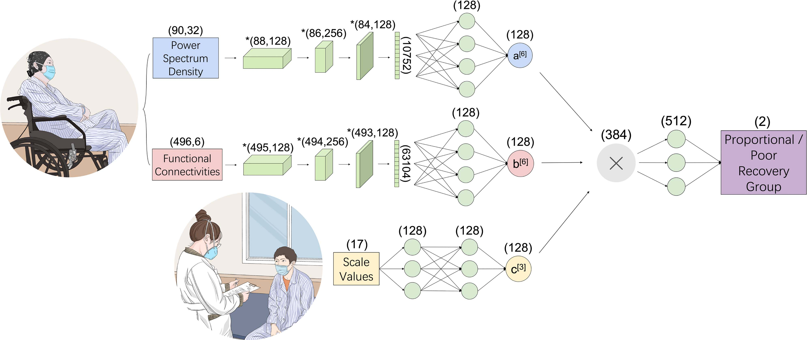
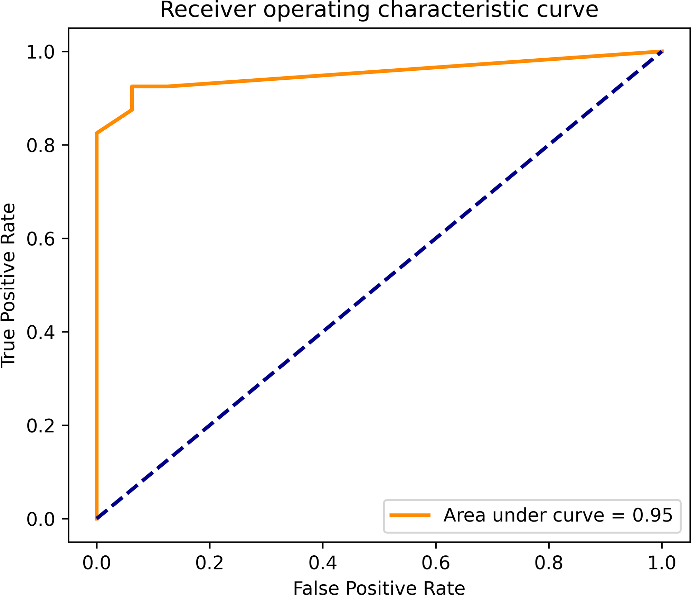
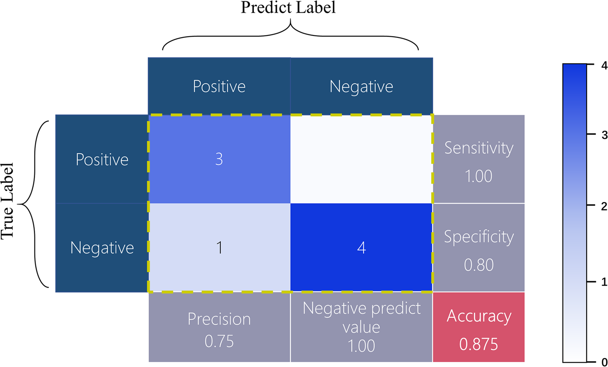
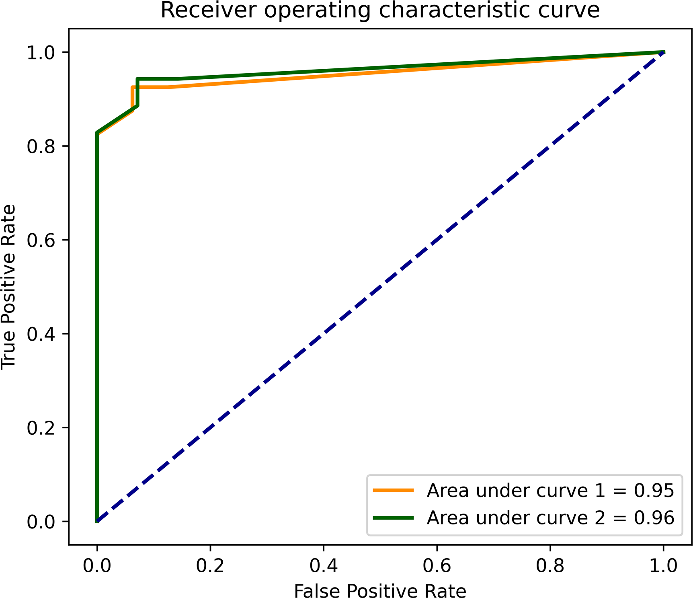
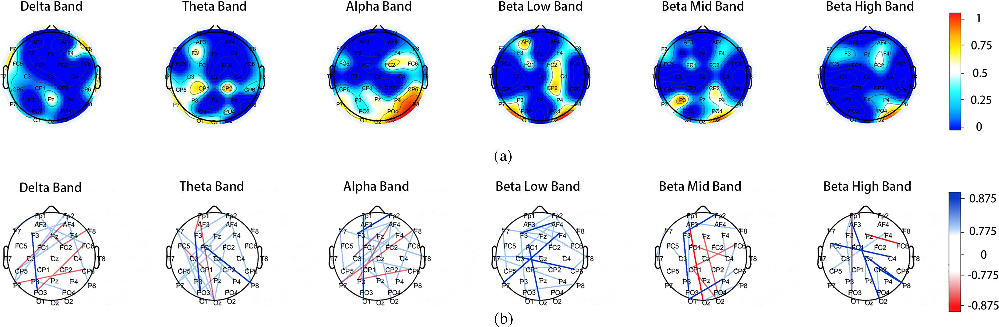

# Lin 2022 Reader: Transferable Deep Learning Prognosis Model

Source PDF: `C:/Users/HPGZZ/Desktop/预后模型相关文献/Lin 等 - 2022 - A Transferable Deep Learning Prognosis Model for Predicting Stroke Patients' Recovery in Different R.pdf`

Reader status: section- and figure-aware structural reader for manuscript writing. The source PDF has selectable text, 9 pages, 151 extracted text blocks, 7 embedded image objects, and page-level PNG assets in `assets/`. This reader avoids reproducing the full copyrighted article text. Use `source_map.json` for exact block-level source lookup.

## Paper Type

This is a small-cohort clinical prognosis modelling paper in rehabilitation engineering. Its core move is not a new disease mechanism, but a transferable multi-input deep-learning prognosis model trained in one rehabilitation context and tested in a related rehabilitation context.

**中文:** 这是一篇小样本康复工程预后建模论文。核心不是证明新的神经机制，而是证明一个多输入深度学习预后模型可以在相近康复训练之间迁移。

## Page And Section Index

| Source location | Section | Function in Lin paper |
|---|---|---|
| p.1 | Abstract and Introduction | Frames stroke recovery prognosis as difficult, motivates multi-treatment prediction and transferability. |
| p.2 | Participants, clinical measurements, biomechanical measurements | Establishes ethics, registration, inclusion criteria, and participant-level measurement set. |
| p.3 | EEG measurement, PSD/connectivity extraction, treatments, labeling | Defines neurophysiology pipeline, intervention arms, and proportional-recovery label. |
| p.4 | Model framework and treatment figures | Shows the multi-input CNN architecture and rehabilitation context. |
| p.5 | Model explanation and statistics; Results start | Defines SHAP/GradientExplainer, correlation and group-difference tests, then reports manual-stretching model performance. |
| p.6 | Transfer model results | Reports pre-trained manual-stretching model performance on robot-assisted training. |
| p.7 | Key factors and patient characteristics | Uses explainability and statistics to identify clinical, biomechanical, PSD, and connectivity factors. |
| p.8 | Discussion and Conclusion | Interprets transferability, clinical relevance, model limitations, and future use. |
| p.9 | References | Supports stroke rehabilitation, proportional recovery, EEG features, CNN and SHAP methods. |

## Structural Reading

### Abstract

**Source:** p.1, extracted blocks around abstract.

**What Lin writes:** The abstract moves through six jobs: rehabilitation prognosis is difficult; different treatments can produce different outcomes; the study asks whether a model built for one treatment can predict another treatment's outcome; 15 stroke survivors underwent clinical, biomechanical and EEG measurements before and after intervention; a multi-input deep-learning prognosis model was trained and transferred; performance and key explanatory features are summarized.

**中文理解:** 摘要先提出卒中康复预后难，再指出多种康复训练之间结果不同且模型迁移不足，随后交代样本量、输入模态、模型任务、迁移测试和解释性发现。它不是把所有方法细节写满，而是突出“跨治疗迁移预后模型”这个核心贡献。

**Writing lesson for our paper:** Our abstract should similarly follow `clinical need -> modelling gap -> cohort and input -> model -> validation result -> bounded implication`. Because our study lacks external validation, the final sentence must state pilot/internal-validation boundaries.

### Introduction

**Source:** p.1, Introduction.

**What Lin writes:** The Introduction uses a narrow funnel: stroke burden and motor impairment; emerging rehabilitation therapies; clinical, demographic and neurophysiological predictors; prior machine-learning/deep-learning prediction work; the unresolved need for models that can predict outcomes across related rehabilitation treatments; study aim.

**中文理解:** Lin 的引言不是先讲模型细节，而是先从卒中康复临床异质性讲起，再把临床量表、人口学、神经生理数据纳入“可预测恢复”的证据链，最后收束到“不同治疗之间模型是否可迁移”的具体问题。

**Writing lesson for our paper:** Our Introduction should not begin with SSL-CNN. It should begin with post-stroke upper-limb recovery variability, then proportional recovery, then EEG as a scalable neurophysiological marker, then the three methodological gaps: small labelled cohorts, patient-level leakage risk, and loss of continuous residual information.

### Participants

**Source:** p.2, Materials and Methods, Participants; Table I.

**What Lin writes:** This section includes ethics approval, Declaration of Helsinki statement, clinical trial registration, recruitment window, consent, recruitment site, inclusion criteria, safety/adverse-event statement, and a patient information table.

**中文理解:** 参与者部分把“研究是否合规、样本从哪里来、为什么可进入分析、是否有不良事件”一次性交代清楚。Table I 承担了样本基本信息和治疗前后主要指标的支撑作用。

**Writing lesson for our paper:** Our manuscript already has patient counts, but final submission is still blocked by ethics approval number, consent wording, recruitment dates, inclusion/exclusion criteria, stroke subtype rules and safety monitoring details. These cannot be invented from data files.

### Clinical And Biomechanical Measurements

**Source:** p.2-p.3, Clinical Measurements and Biomechanical Measurements.

**What Lin writes:** Lin defines each clinical scale and biomechanical measurement, gives score ranges or units, and states when measurements were performed. This makes the model inputs reproducible and clinically interpretable.

**中文理解:** 这些小节的写法重点是“每个变量是什么、量纲是什么、何时测量、为什么进入模型”。它们不是结果描述，而是输入变量和结局定义的来源说明。

**Writing lesson for our paper:** For our paper, clinical variables should be described as cohort descriptors and endpoint-defining variables unless used in exploratory clinical models. The primary EEG model should clearly state that clinical post-treatment variables are not model inputs.

### Neurophysiological Measurements And EEG Features

**Source:** p.3, Neurophysiological Measurements; EEG PSD and functional connectivities.

**What Lin writes:** This section describes EEG system, channel count, sampling rate, preprocessing boundary, PSD computation, frequency grid, connectivity metric, channel-pair structure, and normalization. Lin organizes EEG features into PSD matrices and functional-connectivity matrices before feeding them to CNN branches.

**中文理解:** EEG 方法写作要先说明采集与预处理，再说明 PSD 和连接特征如何从 EEG 变成模型可读矩阵，最后说明标准化和输入维度。读者需要能复现“EEG -> 特征矩阵 -> 模型输入”的路径。

**Writing lesson for our paper:** Our Methods should keep the verified boundary explicit: analyses start from preprocessed EEGLAB files, then compute affected-side-aligned EO/EC PSD and WPLI. Acquisition hardware, online reference and upstream preprocessing remain author-confirmed fields.

### Treatments

**Source:** p.3-p.4, Treatments; Fig. 2.

**What Lin writes:** The treatment section defines two rehabilitation arms, treatment schedule, therapist experience, safety checks, and device-assisted procedure. Fig. 2 visually anchors the two treatment contexts.

**中文理解:** 干预部分不仅说明“做了什么治疗”，还说明治疗频率、疗程、操作者、设备和安全边界。图 2 的作用是让读者迅速理解两个康复情境，而不是证明模型性能。

**Writing lesson for our paper:** Our tACS protocol must include stimulation target, frequency, current, duration, number of sessions, device, impedance, concurrent rehabilitation, assessor blinding and safety/adverse-event capture. Missing items should remain author queries.

### Labeling Of Development Datasets

**Source:** p.3-p.4, Labeling of the Development Datasets.

**What Lin writes:** Lin derives proportional-recovery labels from expected recovery and residuals, then assigns patients to proportional-recovery or poor-recovery groups using a residual threshold.

**中文理解:** 标签小节不是结果，它是模型任务定义。它需要公式、阈值、标签含义，以及训练/测试时如何使用这些标签。

**Writing lesson for our paper:** Our residual median threshold, signed residual distance and binary label should remain in Methods. We should repeatedly state that the threshold is cohort-specific and not an externally validated clinical cut-off.

### Deep Learning Model

**Source:** p.4-p.5; Fig. 1.

**What Lin writes:** Fig. 1 shows three model inputs: scaled clinical/biomechanical values, EEG functional connectivity matrices, and EEG power-spectrum matrices. The model uses convolutional blocks for matrices and dense layers for scaled values, then combines them into a binary recovery output.

**中文理解:** Fig. 1 是整篇方法的核心图。它把输入模态、矩阵维度、卷积模块、融合层和二分类输出放在一张图里。正文围绕这张图解释每个输入为什么进入模型。

**Writing lesson for our paper:** Our Fig. 1 or methods figure should similarly show the complete path from baseline EEG to PSD/WPLI branches, patient-level SSL, residual-aware auxiliary heads and classification-head inference. The figure should also show patient-level validation to make leakage control visible.

### SHAP Interaction Values And Statistics

**Source:** p.5.

**What Lin writes:** Lin uses GradientExplainer, combining ideas from integrated gradients, SHAP and SmoothGrad, to explain deep-learning outputs. Statistical analysis then checks correlations and group differences among key features.

**中文理解:** 解释性小节把模型解释和传统统计连接起来：先从模型得到重要特征，再用相关分析或组间差异评估这些特征是否与恢复有关。

**Writing lesson for our paper:** Our explainability should use IG/SmoothGrad, occlusion, MNE topomap and WPLI connectivity as model-dependent evidence. We should not claim causal biomarkers. Any group-difference validation should be presented as exploratory.

### Results: Primary Model Performance

**Source:** p.5-p.6; Fig. 3 and Fig. 4.

**What Lin writes:** The first Results subsection reports leave-one-out model performance for manual stretching, including ROC-AUC, sensitivity, specificity and confusion matrix. The result is anchored by Fig. 3 and Fig. 4.

**中文理解:** 性能结果不是只给一个准确率，而是配套 ROC、混淆矩阵、敏感度和特异度。这样读者能判断模型是否只是偏向某一类。

**Writing lesson for our paper:** Our performance Results should lead with locked patient-level metrics, then uncertainty, paired comparisons, permutation tests and confusion matrix. Given n=19, every performance paragraph should include precision boundaries.

### Results: Transfer Performance

**Source:** p.6; Table II and Fig. 5.

**What Lin writes:** Lin applies the pre-trained manual-stretching prognosis model to robot-assisted training and reports average accuracy, sensitivity, specificity and ROC-AUC, including analysis excluding an out-of-bound parameter set.

**中文理解:** 第二个结果小节服务“transferable”这个标题。它不是简单重复性能，而是证明模型在另一个康复训练情境中仍有预测能力。

**Writing lesson for our paper:** Our equivalent is not cross-treatment transfer but robustness/ablation: no-SSL CNN, SSL without residual heads, residual-aware without SSL, feature/state/band ablations, and threshold-sensitivity/precision audits.

### Results: Key Factors And Patient Characteristics

**Source:** p.6-p.7; Fig. 6.

**What Lin writes:** Lin uses GradientExplainer-derived PSD and connectivity maps, then reports biomechanical and EEG features associated with recovery. Patient characteristics are compared between proportional-recovery and poor-recovery groups.

**中文理解:** 这部分把“模型能预测”推进到“模型可能依赖什么信息”。图 6 用拓扑图和连接图承载解释性证据，正文再把主要频段、脑区和连接关系转成文字。

**Writing lesson for our paper:** Our Figure 4 and supplementary MNE connectivity maps should serve the same role. The text should say the model localized information to state-dependent PSD and beta-band connectivity, but the interpretation remains hypothesis-generating.

### Discussion

**Source:** p.7-p.8.

**What Lin writes:** The Discussion opens with the central claim: a transferable deep-learning prognosis model across rehabilitation treatments is feasible. It then discusses why multi-input data help, why pre-trained models can reduce data needs, what key features imply, and what limitations remain.

**中文理解:** 讨论不是按图重复结果，而是回答四个问题：研究证明了什么、为什么可信、与既往研究有什么关系、哪些边界不能越过。

**Writing lesson for our paper:** Our Discussion should open with residual-aware EEG learning feasibility, then discuss residual-aware supervision, patient-level SSL and leakage control, clinical-only model strength, explainability, and limitations.

### Conclusion

**Source:** p.8.

**What Lin writes:** The conclusion is short and restates multi-input deep learning and transferability between rehabilitation scenarios.

**中文理解:** 结论只收束主贡献，不引入新结果。它强调模型可迁移的潜力，而非立即临床应用。

**Writing lesson for our paper:** Our conclusion should say residual-aware self-supervised EEG learning is a promising pilot framework for patient-level proportional-recovery prediction, and explicitly require prospective external validation.

## Extracted Figure Assets

| Asset | Source page | Likely paper item | Role |
|---|---:|---|---|
| `assets/lin_p04_image_02.jpeg` | 4 | Fig. 1 | Multi-input deep-learning prognosis model framework |
| `assets/lin_p04_image_01.jpeg` | 4 | Fig. 2 | Manual and robot-assisted stretching treatment examples |
| `assets/lin_p05_image_01.png` | 5 | Fig. 3 | ROC for manual-stretching prognosis model |
| `assets/lin_p06_image_01.png` | 6 | Fig. 4 | Confusion matrix for manual-stretching model |
| `assets/lin_p06_image_02.png` | 6 | Fig. 5 | ROC curves for transferred robot-assisted model |
| `assets/lin_p07_image_01.png` | 7 | Fig. 6 | SHAP interaction PSD topomaps and connectivity maps |

## Direct Implications For Our Manuscript

1. Lin's model framework figure is central and early. Our manuscript should keep a strong model/flow figure early, but include patient-level validation and residual-aware heads because those are our methodological distinctions.
2. Lin places participant details and measurement definitions before model architecture. Our Methods should keep cohort, endpoint, EEG acquisition/preprocessing, feature extraction and model training in that order.
3. Lin uses one results sequence: model performance, transfer performance, key factors, patient characteristics. Our sequence should be cohort/outcome, primary performance, statistical uncertainty, ablation/robustness, clinical incremental caveat, and explainability.
4. Lin uses topomap/connectivity visualizations for explanation. Our MNE topomap and WPLI connectivity figures are appropriate, but should be labelled as attribution maps, not raw PSD or raw WPLI physiology.
5. Lin's limitations are implicit and relatively brief. Our paper should be more conservative: n=19, no external validation, cohort-derived threshold, strong clinical-only baseline, and author-metadata gaps before final submission.

